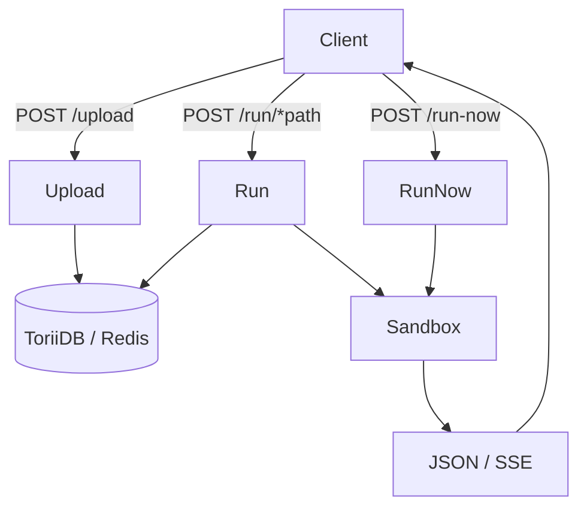

Last updated: 2026-10-06

> [!NOTE]
> This README was generated by [SKILL](https://github.com/agenvoy/skill-readme-generate), get the ZH version from [here](./doc/README.zh.md).

***

<strong>SELF-HOSTED FAAS, NO DOCKER OR KUBERNETES REQUIRED</strong>

***

> A Go self-hosted FaaS with sandboxed code execution, timestamp-versioned scripts, and SSE streaming

## Table of Contents

- [Features](#features)
- [Architecture](#architecture)
- [License](#license)
- [Author](#author)

## Features

> `git clone https://github.com/pardnchiu/HakoRun && cd HakoRun && make run` · [Documentation](./doc/doc.md)

- **Upload to Deploy** — Upload a Python, JavaScript, or TypeScript function and invoke it over HTTP at `/run/<path>`, with the return value auto-tagged as `string`, `number`, `json`, or `text`.
- **OS-native Sandbox** — Linux runs scripts in Bubblewrap with every namespace unshared, no network, and all capabilities dropped; macOS confines writes to `$HOME` through a seatbelt profile.
- **systemd Slice Resource Caps** — On Linux every script process runs under `hakorun.slice`, whose CPU quota and memory ceiling keep one script from starving the host.
- **Timestamp-versioned Storage** — Each upload creates a new version you can pin with `?version=`, stored in embedded ToriiDB by default or Redis via `-tags redis`.
- **SSE Streaming with Instant Abort** — Stdout lines stream as `log` events, and any stderr output, timeout, or client disconnect kills the process.

## Architecture

> [Full Architecture](./doc/architecture.md)

## License

This project is licensed under the [MIT LICENSE](LICENSE).

## Author

Just [open an issue](https://github.com/pardnchiu/HakoRun/issues/new) to share an idea.

***

©️ 2025 [邱敬幃 Pardn Chiu](https://www.linkedin.com/in/pardnchiu)
