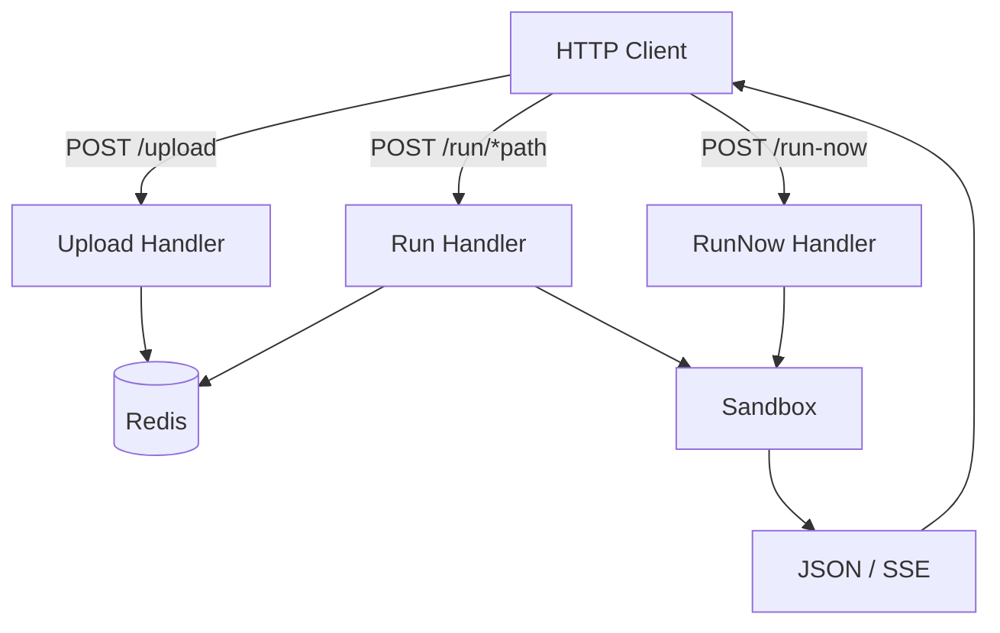

> [!NOTE]
> This README was generated by [SKILL](https://github.com/agenvoy/skill-readme-generate), get the ZH version from [here](./doc/README.zh.md).

***

<strong>SECURE MULTI-LANGUAGE FAAS WITH SANDBOXED EXECUTION</strong>

***

> A Go FaaS platform with Bubblewrap sandboxing, Redis script versioning, and SSE streaming

## Table of Contents

- [Features](#features)
- [Architecture](#architecture)
- [License](#license)
- [Author](#author)

## Features

> `go install github.com/pardnchiu/go-faas/cmd/api@latest` · [Documentation](./doc/doc.md)

- **Bubblewrap Sandbox Isolation** — User code runs under bwrap with namespaces, dropped capabilities, and no host or outbound network access.
- **Multi-Language Versioned Scripts** — Upload Python, JavaScript, or TypeScript to Redis with timestamp versions and run latest or a specific revision.
- **Systemd Slice Resource Caps** — Each sandbox is launched via systemd-run under a slice that enforces CPU quota and memory ceilings.
- **SSE Streaming Execution** — Stream intermediate logs and final results over Server-Sent Events for long-running or progressive scripts.
- **Immediate Run-Now Mode** — Execute ad-hoc code without storing it, for quick trials and one-shot jobs.

## Architecture

> [Full Architecture](./doc/architecture.md)

## License

This project is licensed under the [GNU Affero General Public License v3.0](LICENSE).

## Author

<h4 style="padding-top: 0">邱敬幃 Pardn Chiu</h4>

<a href="mailto:hi@pardn.io">hi@pardn.io</a> 
<a href="https://www.linkedin.com/in/pardnchiu">https://www.linkedin.com/in/pardnchiu</a>

***

©️ 2025 [邱敬幃 Pardn Chiu](https://www.linkedin.com/in/pardnchiu)
