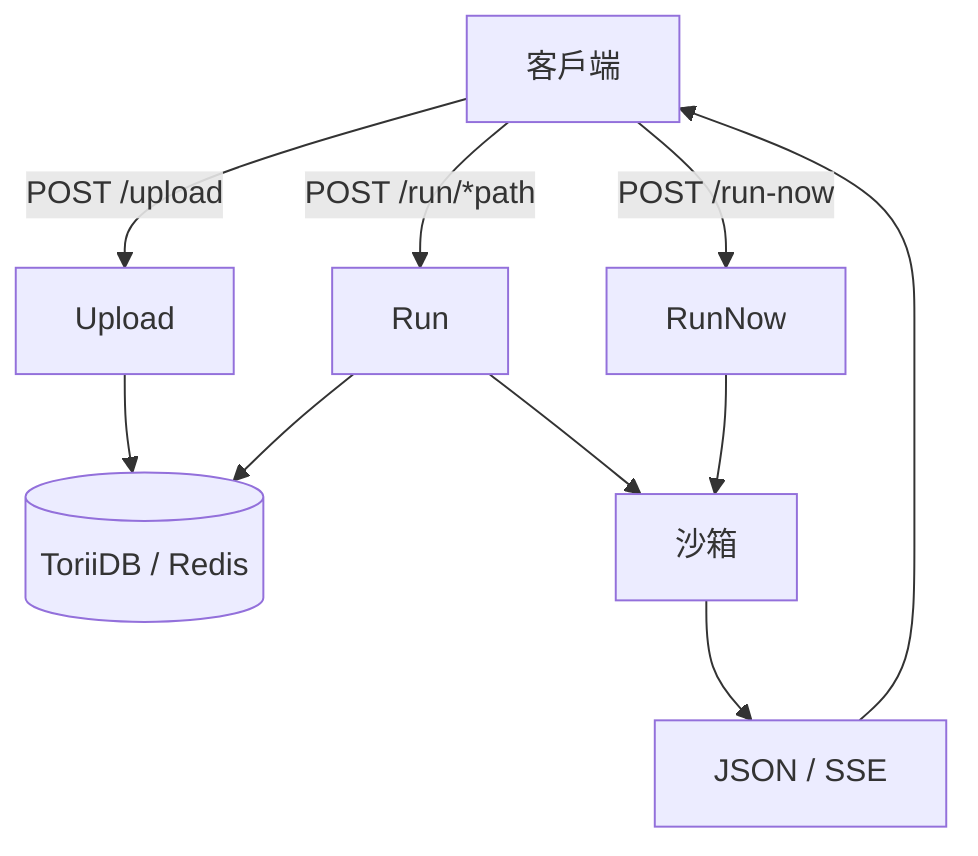

最後更新：2026-10-06

> [!NOTE]
> 此 README 由 [SKILL](https://github.com/agenvoy/skill-readme-generate) 生成，英文版請參閱 [這裡](../README.md)。

***

<strong>SELF-HOSTED FAAS, NO DOCKER OR KUBERNETES REQUIRED</strong>

***

> Go 自架 FaaS，具備程式碼沙箱執行、時間戳版本化腳本與 SSE 串流

## 目錄

- [功能特點](#功能特點)
- [架構](#架構)
- [授權](#授權)
- [Author](#author)

## 功能特點

> `git clone https://github.com/pardnchiu/HakoRun && cd HakoRun && make run` · [完整文件](./doc.zh.md)

- **上傳即部署** — 上傳 Python／JavaScript／TypeScript 函式後即可透過 HTTP 以 `/run/<path>` 呼叫，回傳值自動標註為 `string`／`number`／`json`／`text`。
- **OS 原生沙箱** — Linux 以 Bubblewrap 解除共享全部命名空間、斷網並丟棄所有 capability，macOS 以 seatbelt 將寫入限縮於 `$HOME`。
- **systemd Slice 資源上限** — Linux 上每個腳本行程掛在 `hakorun.slice`，以 CPU 配額與記憶體上限防止單一腳本拖垮主機。
- **時間戳版本化儲存** — 每次上傳產生新版本並可用 `?version=` 釘選，預設內嵌 ToriiDB，以 `-tags redis` 切換為 Redis。
- **SSE 串流與即時中止** — stdout 逐行推送為 `log` 事件，stderr 出現輸出、逾時或客戶端斷線即終止行程。

## 架構

> [完整架構](./architecture.zh.md)

## 授權

本專案採用 [MIT LICENSE](../LICENSE)。

## Author

Just [open an issue](https://github.com/pardnchiu/HakoRun/issues/new) to share an idea.

***

©️ 2025 [邱敬幃 Pardn Chiu](https://www.linkedin.com/in/pardnchiu)
