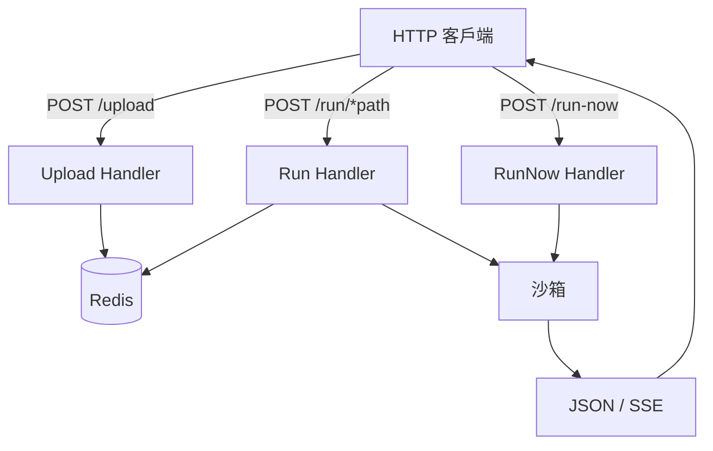

> [!NOTE]
> 此 README 由 [SKILL](https://github.com/agenvoy/skill-readme-generate) 生成，英文版請參閱 [這裡](../README.md)。

***

<strong>SECURE MULTI-LANGUAGE FAAS WITH SANDBOXED EXECUTION</strong>

***

> Go FaaS 平台，具備 Bubblewrap 沙箱、Redis 腳本版本控管與 SSE 串流

## 目錄

- [功能特點](#功能特點)
- [架構](#架構)
- [授權](#授權)
- [Author](#author)

## 功能特點

> `go install github.com/pardnchiu/go-faas/cmd/api@latest` · [完整文件](./doc.zh.md)

- **Bubblewrap 沙箱隔離** — 使用者程式碼在 bwrap 下以 namespace 隔離執行，移除全部 Capability，無法存取主機或對外連線。
- **多語言版本化腳本** — 透過 HTTP 上傳 Python、JavaScript、TypeScript 至 Redis，以時間戳版本管理，可指定版本或取最新。
- **Systemd Slice 資源上限** — 每個沙箱由 systemd-run 歸屬自訂 slice，強制限制 CPU 配額與記憶體上限。
- **SSE 串流執行** — 以 Server-Sent Events 即時推送中間 log 與最終結果，適合長時間或漸進輸出腳本。
- **立即 Run-Now 模式** — 不經儲存即可執行臨時程式碼，方便快速試驗與一次性任務。

## 架構

> [完整架構](./architecture.zh.md)

## 授權

本專案採用 [GNU Affero General Public License v3.0](../LICENSE)。

## Author

<h4 style="padding-top: 0">邱敬幃 Pardn Chiu</h4>

<a href="mailto:hi@pardn.io">hi@pardn.io</a> 
<a href="https://www.linkedin.com/in/pardnchiu">https://www.linkedin.com/in/pardnchiu</a>

***

©️ 2025 [邱敬幃 Pardn Chiu](https://www.linkedin.com/in/pardnchiu)
