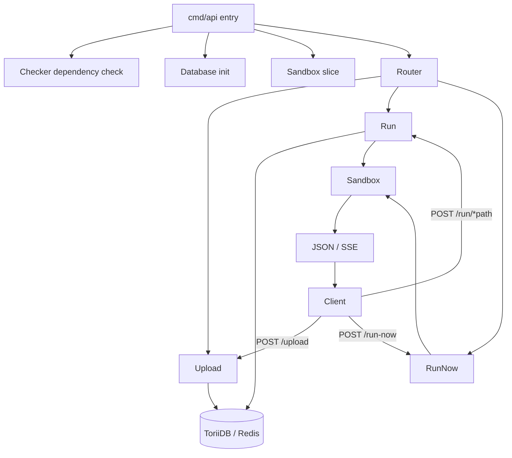
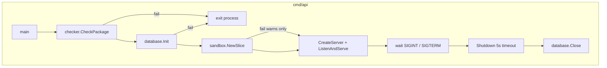
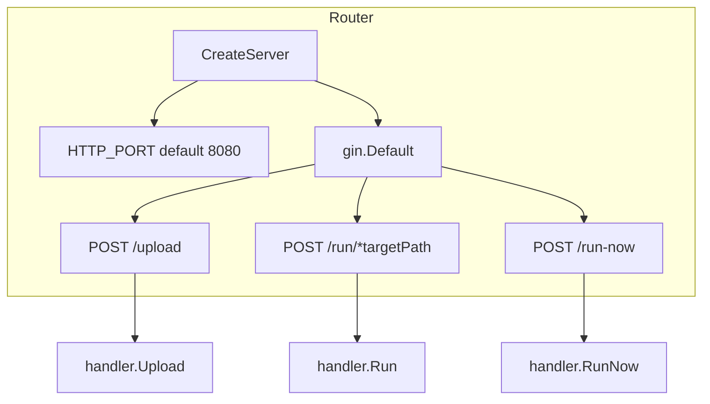
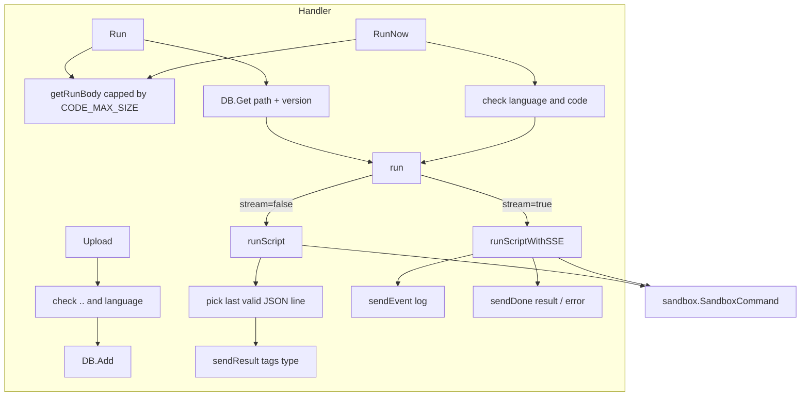
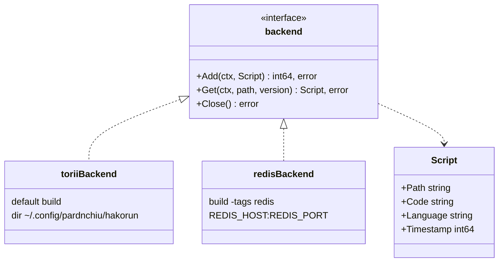
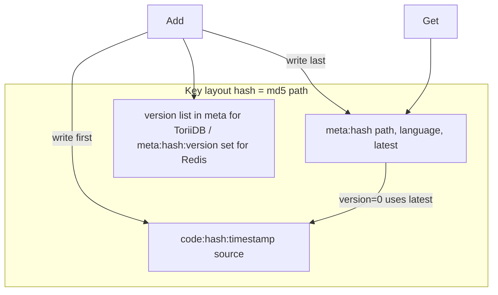
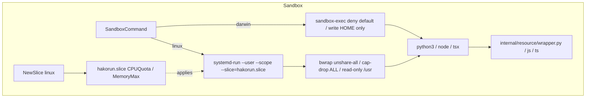
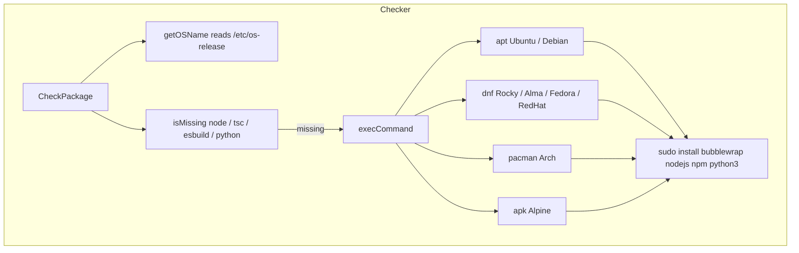
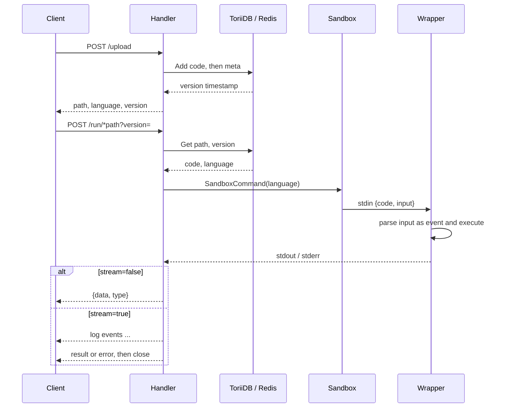
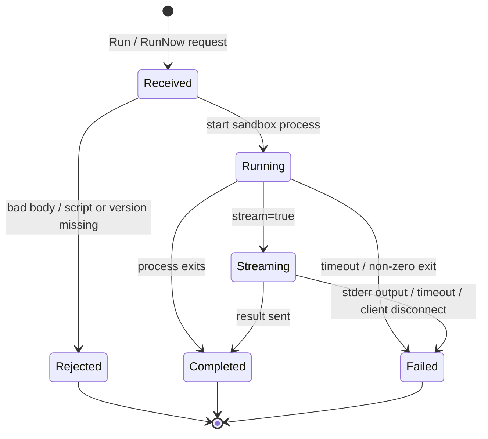

# HakoRun - Architecture

Last updated: 2026-10-06

> Back to [README](../README.md)

## Overview

## Module: Entry

Runs the dependency check, storage init, slice setup, and HTTP server in order, then shuts down gracefully on signal.

## Module: Router

Builds the Gin engine, registers three routes, and binds `HTTP_PORT`.

## Module: Handler

Validates requests, loads scripts, and routes by `stream` to one-shot or SSE execution.

## Module: Database

A build tag selects the backend; both share the `backend` interface and the same key layout.

## Module: Sandbox

Builds a confined child-process command per platform; the wrapper reads `{code, input}` from stdin.

## Module: Checker

Detects the runtime toolchain on Linux startup and installs missing packages; a no-op on macOS.

## Data Flow

## State Machine

***

©️ 2025 [邱敬幃 Pardn Chiu](https://www.linkedin.com/in/pardnchiu)
