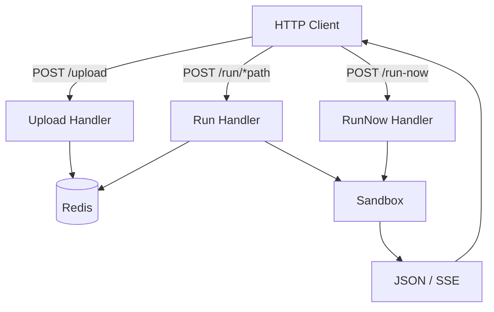
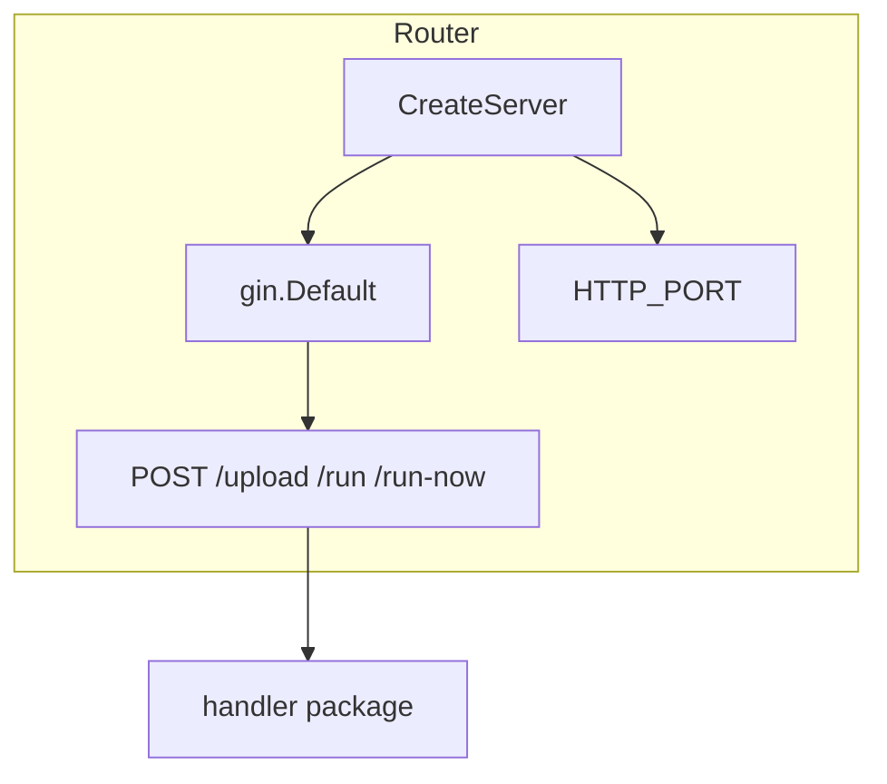
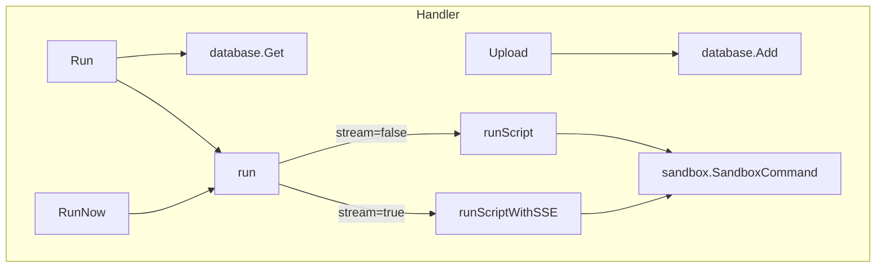
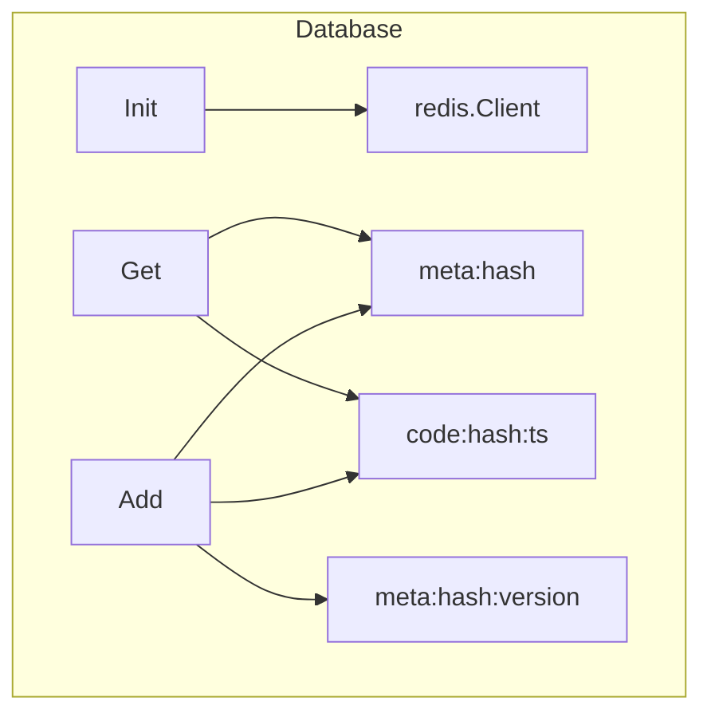
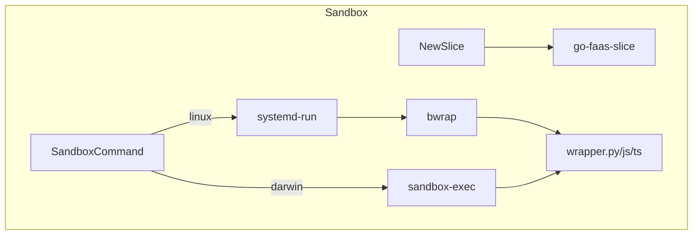
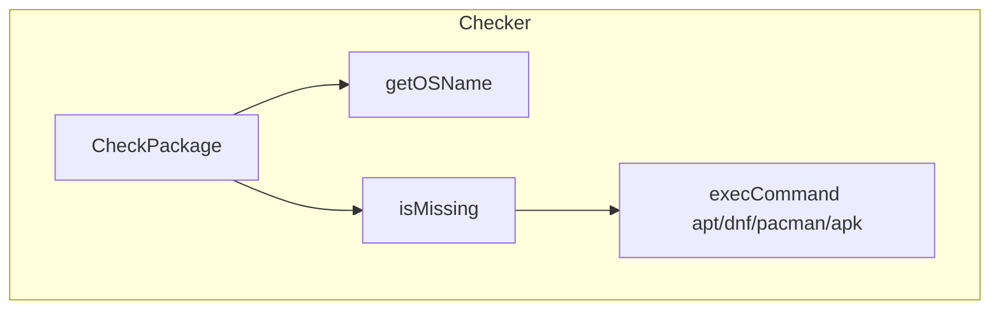
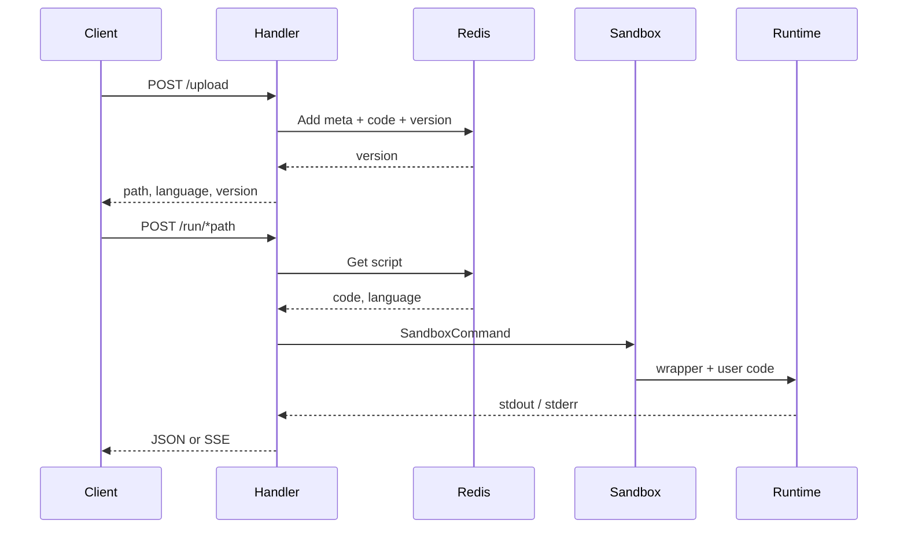
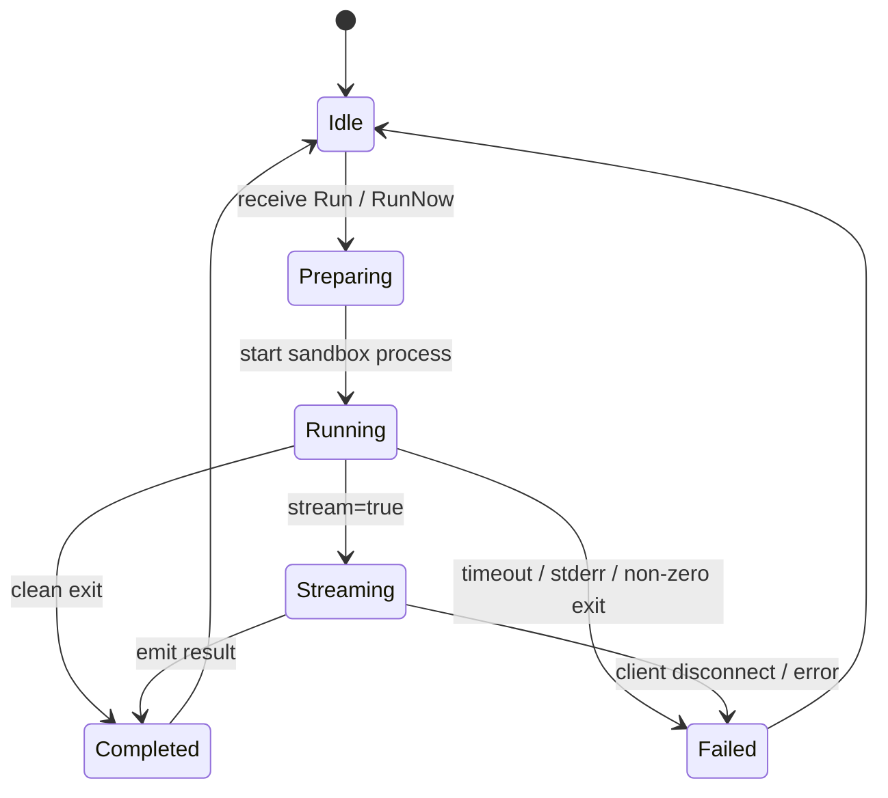

# go-faas - Architecture

> Back to [README](../README.md)

## Overview

## Module: Router

Creates the Gin engine, registers HTTP routes, and binds the listen port.

## Module: Handler

Handles upload, stored-script execution, immediate run, and SSE streaming.

## Module: Database

Stores script metadata, code blobs, and version sets in Redis.

## Module: Sandbox

Builds the isolation environment per platform: Linux uses systemd-run + bwrap; darwin uses sandbox-exec.

## Module: Checker

Checks Node, TypeScript, esbuild, and Python at startup and installs missing packages via the OS package manager when needed.

## Data Flow

## State Machine

***

©️ 2025 [邱敬幃 Pardn Chiu](https://www.linkedin.com/in/pardnchiu)
