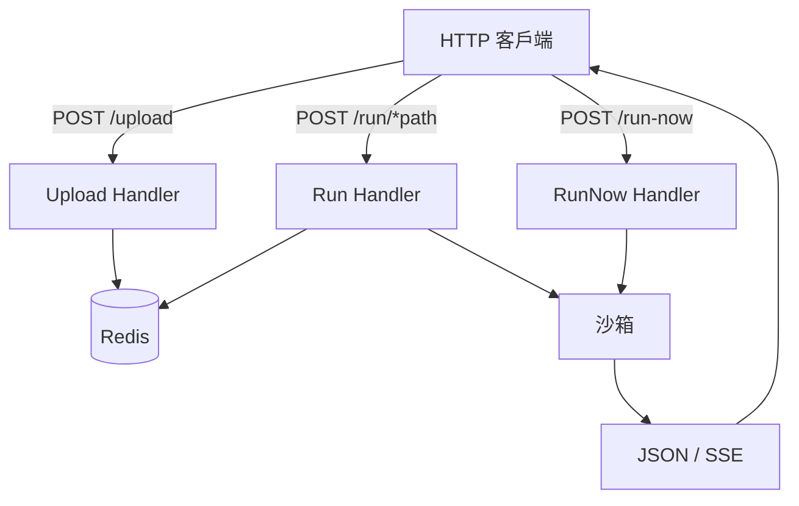
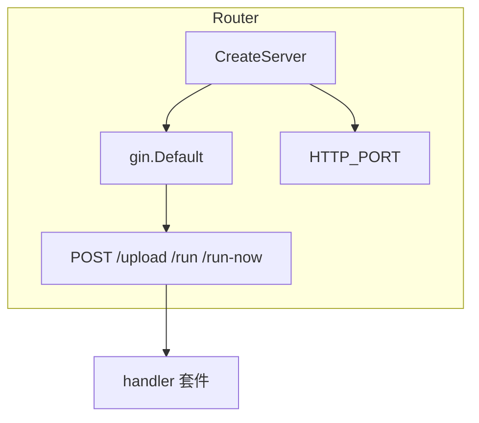
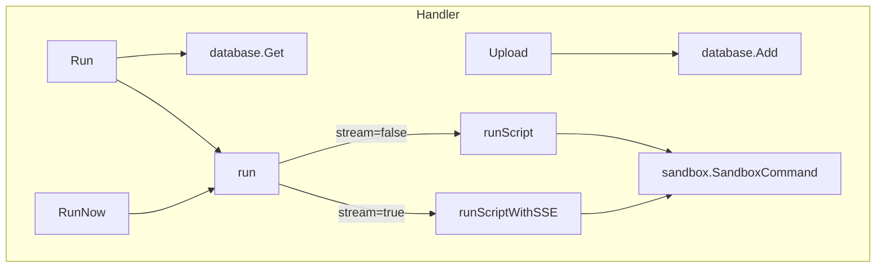
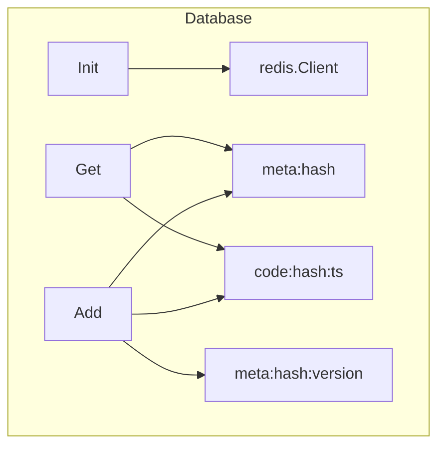
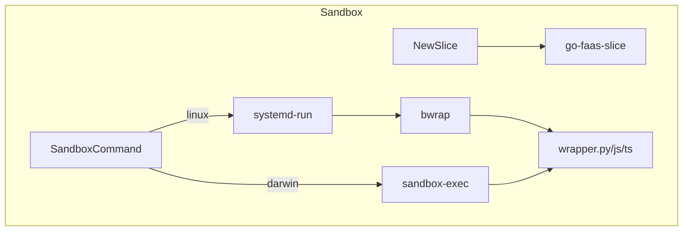
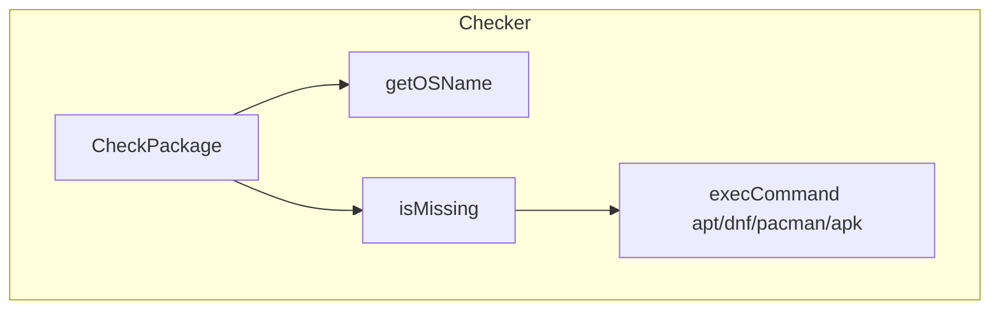
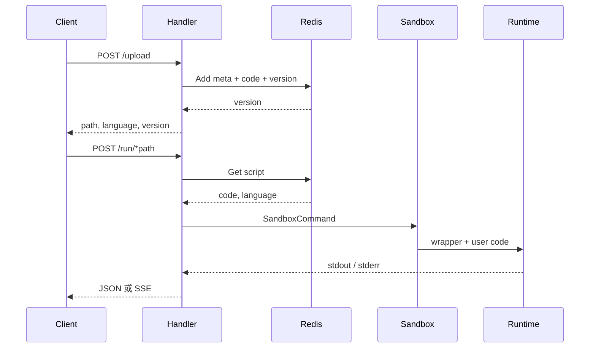
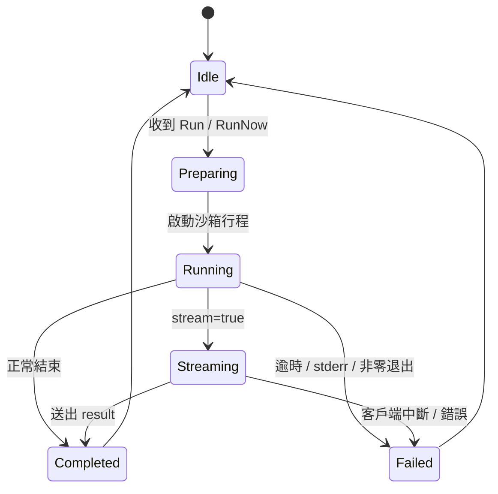

# go-faas - 架構

> 返回 [README](./README.zh.md)

## 概覽

## 模組: Router

負責建立 Gin 引擎、註冊 HTTP 路由與綁定服務埠。

## 模組: Handler

處理上傳、執行已存腳本、立即執行與 SSE 串流。

## 模組: Database

以 Redis 儲存腳本中繼資料、程式碼與版本集合。

## 模組: Sandbox

依平台建立隔離執行環境：Linux 用 systemd-run + bwrap；darwin 用 sandbox-exec。

## 模組: Checker

啟動時檢查 Node、TypeScript、esbuild、Python 等相依，必要時透過套件管理器安裝。

## 資料流

## 狀態機

***

©️ 2025 [邱敬幃 Pardn Chiu](https://www.linkedin.com/in/pardnchiu)
