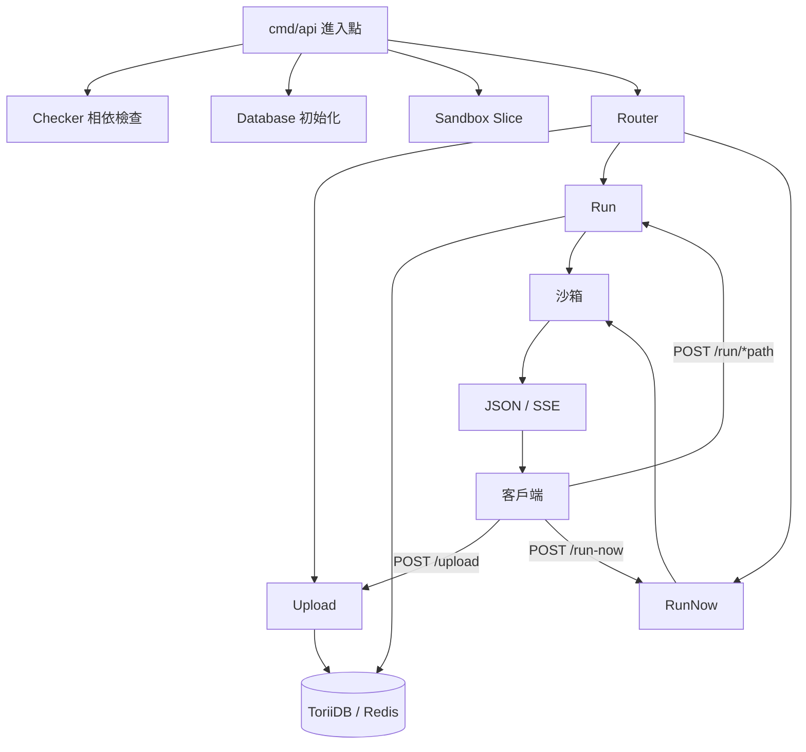
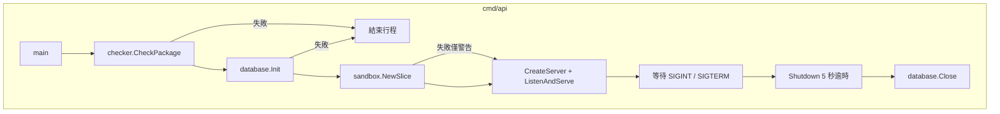
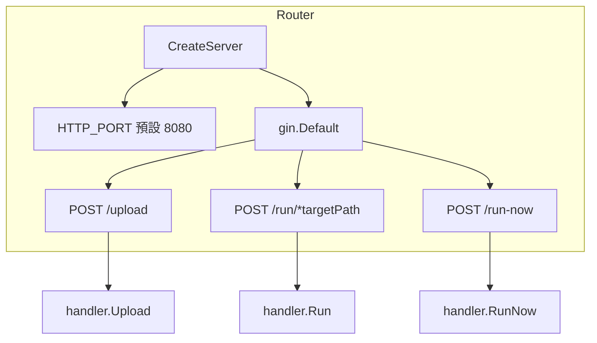
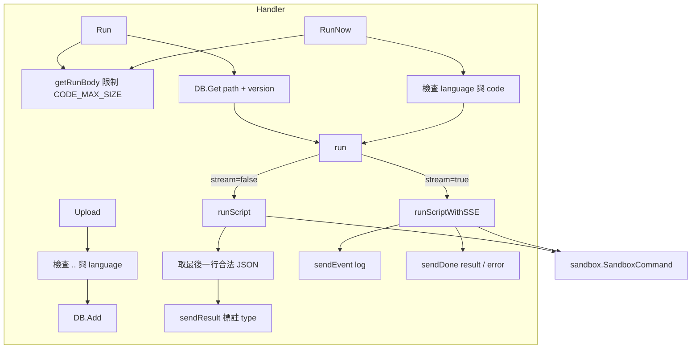
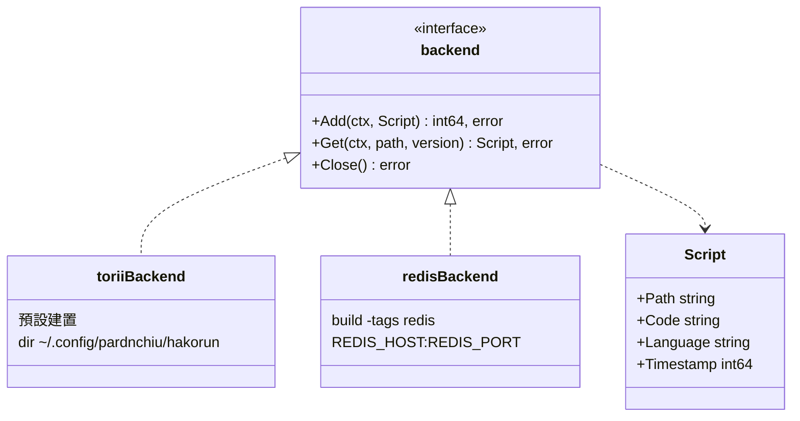
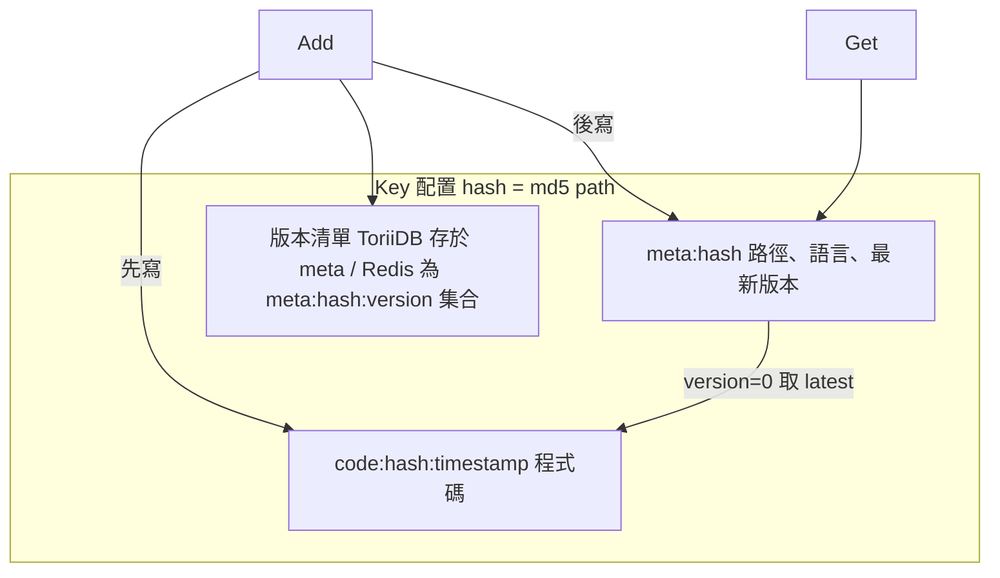
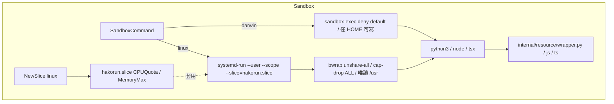
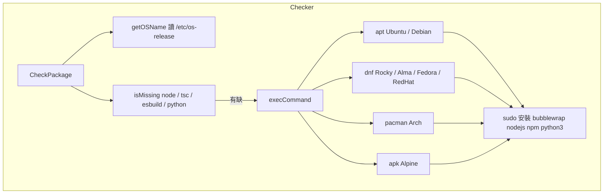
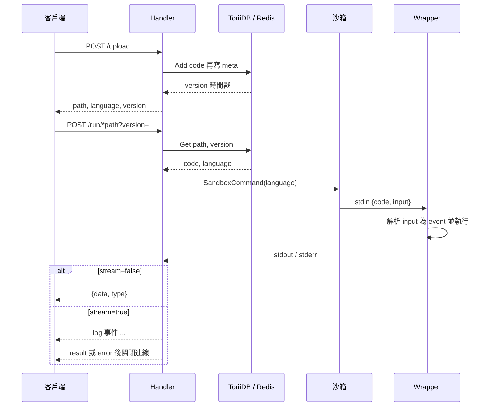
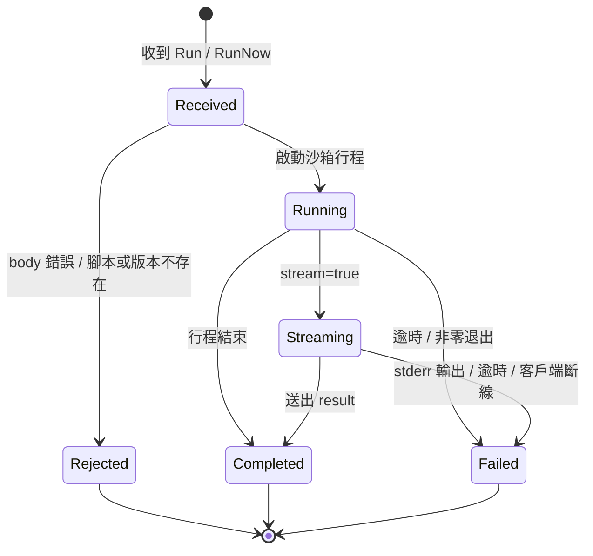

# HakoRun - 架構

最後更新：2026-10-06

> 返回 [README](./README.zh.md)

## 概覽

## 模組: Entry

依序執行相依檢查、儲存初始化、Slice 建立與 HTTP 服務，收到訊號後優雅關閉。

## 模組: Router

建立 Gin 引擎、註冊三條路由並綁定 `HTTP_PORT`。

## 模組: Handler

驗證請求、讀取腳本，依 `stream` 分流至一次性執行或 SSE 串流執行。

## 模組: Database

以建置標籤選擇後端，兩者共用 `backend` 介面與相同的 key 配置。

## 模組: Sandbox

依平台組出受限的子行程指令，wrapper 由 stdin 讀取 `{code, input}`。

## 模組: Checker

Linux 啟動時偵測執行環境，缺少時以套件管理器安裝；macOS 為 no-op。

## 資料流

## 狀態機

***

©️ 2025 [邱敬幃 Pardn Chiu](https://www.linkedin.com/in/pardnchiu)
